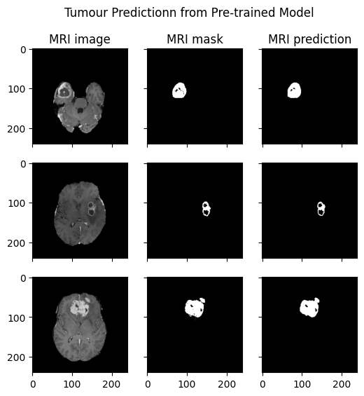
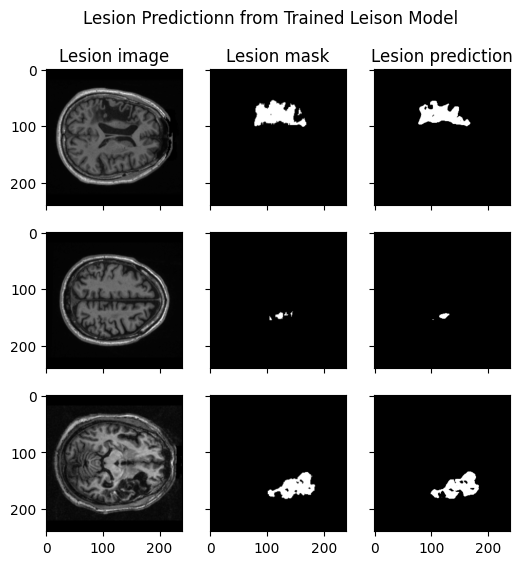

# Brain Lesion Segmentation CM2003 Course Project

[🔹]() Note: The previous labs and reports can still be found under `/Labs`

## ATLAS - Anatomical Tracings of Lesions After Stroke MICCAI CHALLENG

*ATLAS* consists of T1w MRIs and manually segmented lesion masks that includes training (n = 655), test (hidden masks, n = 300). The purpose of this project is to implement a deep learning model for better lesion segmentation on brain MRI images. This dataset can be found [here](https://atlas.grand-challenge.org/ATLAS/) on Grand Challenge.

*Brast17* dataset is from the course lab, which consists of around 9000 T1w MRI images of brain tumour and related masks. The pretrained model used in the transfer learning step is trained with this dataset.

## Data Preprocessing

The preprocessing step transforms all the NIfIT images into 2D slices. Originally, the 3D images are of the size of 189 x 197 x 233 pixels. The 2D slices are on the x-y plane and each image is padded to be square. To achieve better quality of images, the first and last 50 slices are not chosen because they are more likely to be broken or are just part of skull.

## Model Implementation

The main methods for the project are using U-Net with weighted map and transfer learn-
ing. This project is implemented in two steps: (1) training and validation with a standard
U-Net model with weight maps, (2) transfer learning from tumour segmentation to lesion
segmentation. Weighted Dice coefficient is used as the loss function. Dice value, precision
and recall are the main metrics.

## How to Run

[🔹]() Note: All the 2D slices are saved locally during the training. Before running the following steps, please change the corresponding work paths.

0. Preprocessing:

```
python prep.py
```

1. Pre-train the model based on tumour dataset

```
Python pre_train_model.py
```

2. Train the model based on lesion dataset

```
python train_model.py
```

3. Using transfer learning to train the tumour model on lesion dataset

```
python transfer_learning.py
```


## Models and Results:

All the models are based on 2D U-Net architecture.


Pre-Trained Model on Tumour Segmentation (Brast17)

| Batch size | Dropout ratio | Normalisation | Augmentation | Learning rate |         Metrics         |
| :--------: | :-----------: | :-----------: | :----------: | :-----------: | :---------------------: |
|     8     |      0.2      |     True     |    False    |     1e-4     | Dice, Precision, Recall |




Model on Lesion Segmentation (ATLAS)

| Batch size | Dropout ratio | Normalisation | Augmentation | Learning rate |         Metrics         |
| :--------: | :-----------: | :-----------: | :----------: | :-----------: | :---------------------: |
|     8     |      0.2      |     True     |    False    |     1e-4     | Dice, Precision, Recall |



